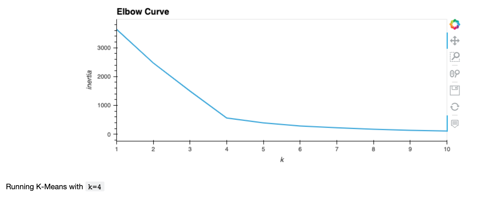
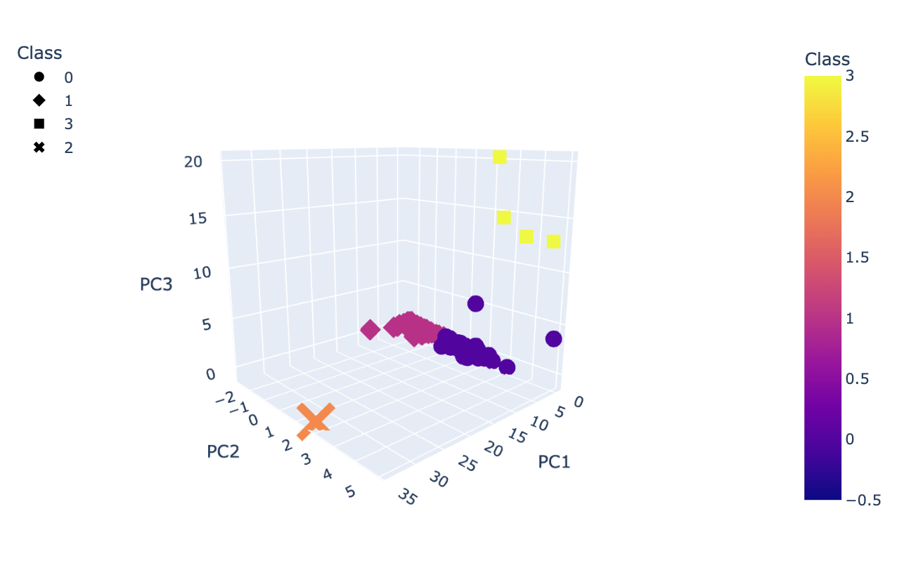
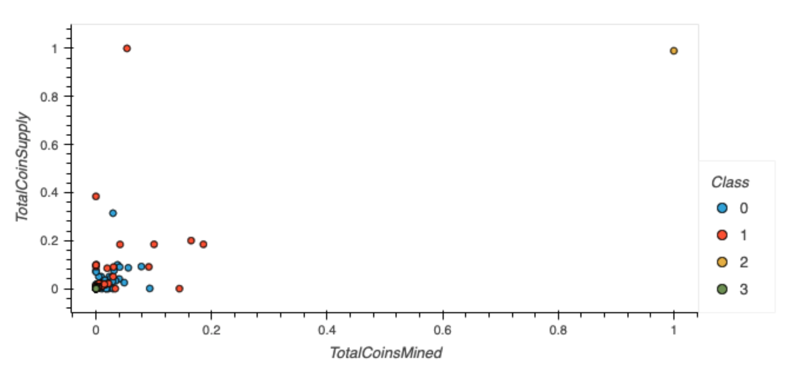

# Cryptocurrencies

## Overview

The purpose of this project is to group cryptocurrencies together to create a classification system and a new investment portofolio for clients of Accountability Accounting. To do so, we created a report that includes what cryptocurrencies are on the trading market for clients. To group the cryptocurrencies, we used a clustering algorithm with an unsupervised machine learning model. Data visualizations are provided to share findings with the board.

### Objectives: 

* Preprocessing the Data for PCA
* Reducing Data Dimensions Using PCA
* Clustering Cryptocurrencies Using K-means
* Visualizing Cryptocurrencies Results

### Data-source:

crypto_data.csv

### Tools:

Jupyter, Python, mlenv working environment

### Libraries:

Pandas, Plotly, scikit-learn, HoloViews

## Results

### Data Visualizations

a. Elbow Curve

b. 3-D plot

c. Scatter plot

